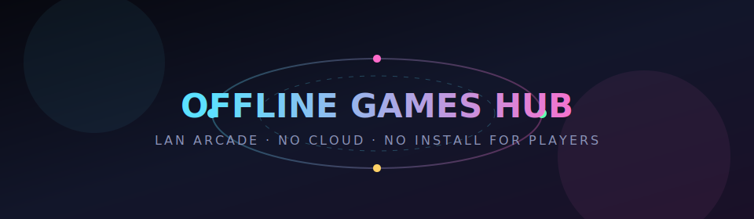

<p align="center">
  
</p>

<h1 align="center">Offline Games Hub</h1>

<p align="center">
  <strong>When the internet dies, the party doesn’t.</strong><br/>
  One machine becomes a LAN arcade. Everyone else joins from a browser.<br/>
  No accounts. No cloud. No app install for players. Just Wi‑Fi and play.
</p>

<p align="center">
  <a href="https://github.com/talgatv/no-signal-lan-arcade">GitHub</a> ·
  <a href="#quick-start">Quick start</a> ·
  <a href="#games">Games</a> ·
  <a href="#architecture">Architecture</a> ·
  <a href="#documentation">Docs</a> ·
  <a href="#roadmap">Roadmap</a>
</p>

<p align="center">
  <code>offline-first</code>&nbsp;·&nbsp;
  <code>LAN multiplayer</code>&nbsp;·&nbsp;
  <code>≤10&nbsp;MB games</code>&nbsp;·&nbsp;
  <code>zero Node in the host</code>&nbsp;·&nbsp;
  <code>MIT</code>
</p>

---

## Why this exists

Power outages. Road trips. Cabins. Camping. Classrooms with blocked networks.  
You still have phones, a laptop, and a power bank — but **no internet**.

**Offline Games Hub** turns one PC (later: phone) into a **local game server**:

```text
   📱  📱  💻  📱
    \  |  |  /
     \ | | /
   ┌───────────┐
   │  HOST PC  │  ← Python server (HTTP + WebSocket)
   │  Wi‑Fi    │  ← serves lobby + game packs
   └───────────┘
         ▲
    open in browser
    http://192.168.x.x:8080
```

Guests never install anything. They open a URL and play.  
When the lights come back, you can still use it — because local is faster, private, and free.

---

## Features

| | |
|--|--|
| **True offline** | No CDN, no telemetry, no “phone home”. Host + games run on LAN only. |
| **Browser clients** | Any modern phone/tablet/laptop. Touch-first UI. |
| **Tiny games** | Hard cap **10 MB** per pack; most are tens of KB. *Maximum fun per kilobyte.* |
| **Plugin catalog** | Each game is a folder + `manifest.json` + metadata in JSON. |
| **LAN multiplayer ready** | Shared protocol + `ogh-net` client; lobby over WebSocket. |
| **PC host today** | Pure **Python 3 stdlib** — no Node, no pip, no `node_modules`. |
| **Portable runtimes** | Windows + Linux Python ships *beside* the project for USB handoff. |
| **Android next** | Kotlin + Compose host (Dual-class stack) planned. |
| **UN languages** | i18n path for en · zh · ru · es · ar · fr. |

---

## Quick start

### 1. Start the PC host

```bash
cd pc
./start.sh          # Linux — uses bundled runtimes/linux64 if present
# Windows:  start.bat
# or:       python3 host.py --port 8080
```

### 2. Open the lobby

- **On the host:** [http://127.0.0.1:8080/](http://127.0.0.1:8080/)  
- **On phones (same Wi‑Fi):** `http://<your-pc-lan-ip>:8080/`

### 3. Connect → pick a game → play

Lobby shows who’s in the room. Games load as static packs under `/games/...`.

> **Fully offline pack:** see [`pc/OFFLINE.md`](pc/OFFLINE.md).  
> Portable Python under `pc/runtimes/` is gitignored (large) but lives on disk for USB copies.

---

## Games

Experimental packs shipping in-repo:

| Game | Feel | Players | Notes |
|------|------|---------|--------|
| **[Comet](games/comet/)** | Neon gravity puzzle | 1 | Place wells, guide the comet, difficulty scales speed & charges |
| **[Comet Pixel](games/comet-pixel/)** | Chunkier pixel twin | 1 | Same soul, grid-snapped wells — a *variant*, not a reskin only |
| **[Rootwork](games/rootwork/)** | 2D dig-build sandbox | 1 | Not Minecraft. Burrow, build, crystal light. Auto-save. |
| **[Pulse Race](games/pulse-race/)** | Neon top-down racing | 1–4* | AI now; multiplayer path via `ogh-net` when host WS is up |

\*Online multiplayer gameplay is rolling out game-by-game; networking plumbing is already in place.

More ideas (party, word, board, trivia…): [`docs/games/CATALOG.md`](docs/games/CATALOG.md)

---

## Architecture

```text
┌────────────────────────────────────────────────────────────┐
│  Platform hosts                                            │
│  • pc/host.py     Python stdlib  — HTTP + WebSocket  ✅    │
│  • android/       Kotlin + Compose host              🔜    │
└────────────────────────────┬───────────────────────────────┘
                             │ LAN
┌────────────────────────────▼───────────────────────────────┐
│  Browser clients                                           │
│  lobby (pc/www)  ·  games/*  ·  shared kit (_shared)       │
│  ogh-net.js → offline fallback OR /ws when host is live    │
└────────────────────────────────────────────────────────────┘
```

**Design rule:** games do not scan the network.  
They all connect to **one host URL**. Discovery = QR / IP, not magic P2P.

Deep dive: [`docs/architecture/MULTIPLAYER.md`](docs/architecture/MULTIPLAYER.md)

### Stack choices (on purpose)

| Layer | Choice | Why |
|-------|--------|-----|
| PC host | Python **stdlib only** | Tiny, offline, no dependency hell |
| Games | HTML / CSS / Canvas / vanilla JS | Universal phones, zero install |
| Net | WebSocket + thin `ogh-net` | One protocol, many games |
| Android (planned) | Kotlin + Jetpack Compose | Native UX, small APK, Dual-like DX |
| Not used | Node-in-APK, Unity, Electron | Too heavy for this philosophy |

---

## Repository layout

```text
OFFline_games_app/
├── README.md                 ← you are here
├── LICENSE                   ← MIT
├── docs/                     vision, architecture, plans
├── games/
│   ├── _shared/              fonts, CSS, sfx, shaders, ogh-net
│   ├── catalog/              JSON registry (genre, controls, authors…)
│   ├── comet/ · comet-pixel/
│   ├── rootwork/
│   └── pulse-race/
├── pc/                       LAN host + lobby + portable Python scripts
└── android/                  host shell (docs first)
```

---

## Documentation

| Doc | What you’ll find |
|-----|------------------|
| [Vision](docs/VISION.md) | Product intent, constraints, success criteria |
| [Game catalog (ideas)](docs/games/CATALOG.md) | Genres, player counts, mechanics |
| [Catalog schema](games/catalog/SCHEMA.md) | Metadata DB shape (JSON → SQLite later) |
| [Core architecture](docs/architecture/CORE.md) | Host adapters, plugins |
| [Android stack](docs/architecture/ANDROID_STACK.md) | Kotlin/Compose host plan |
| [Multiplayer](docs/architecture/MULTIPLAYER.md) | LAN model, protocol draft |
| [Roadmap](docs/plans/ROADMAP.md) | Phases |
| [**LLM development plan**](docs/plans/LLM_DEVELOPMENT_PLAN.md) | Epics, prompts, agent workflow |
| [PC host](pc/README.md) | Run, ports, API |
| [Offline PC pack](pc/OFFLINE.md) | USB / no-internet distribution |

---

## Philosophy

1. **Offline is a feature**, not a fallback.  
2. **Kilobytes are a design material** — treat size like a high score.  
3. **Hosts are thin; games are replaceable packs.**  
4. **Touch first**, keyboard optional, gamepad later.  
5. **Family-friendly by default**; adult packs only as opt-in later.  
6. **Original names & rules** — inspired by classics, not trademark clones.

---

## Roadmap (snapshot)

| Phase | Focus | Status |
|-------|--------|--------|
| 0 | Docs, catalog, first games, PC host | **Done** |
| 1 | Real LAN multiplayer (turn-based → race → party) | In progress |
| 2 | Android host (Compose + foreground service) | Planned |
| 3 | 15–25 micro-games, filters, i18n | Planned |
| 4 | CI, polished release, offline GitHub Release zips | Planned |

Full agent-friendly plan: [`docs/plans/LLM_DEVELOPMENT_PLAN.md`](docs/plans/LLM_DEVELOPMENT_PLAN.md)

---

## Contributing (human or LLM)

**Everyone is welcome** — new games, host fixes, docs, translations.  
Start here: **[CONTRIBUTING.md](CONTRIBUTING.md)**

- Prefer **one game or one subsystem per change**.  
- Update `games/catalog/games.json` when adding a pack.  
- No CDNs. No new heavy frameworks without discussion.  
- Keep each game under **10 MB** (aim far lower).  
- Read the multiplayer & vision docs before networking work.

```text
Prompt starter for AI agents:
  Read docs/VISION.md, docs/architecture/MULTIPLAYER.md,
  docs/plans/LLM_DEVELOPMENT_PLAN.md — then implement ONE task from the plan.
```

---

## License

**MIT** — see [`LICENSE`](LICENSE).

Third-party notes:

- Fonts under `games/_shared/fonts/` — SIL OFL (and JetBrains Mono OFL)  
- Portable CPython under `pc/runtimes/*` (when present) — PSF License  

---

<p align="center">
  <em>Build a pocket arcade that fits on a flash drive.<br/>
  Then invite the whole room — no signal required.</em>
</p>
